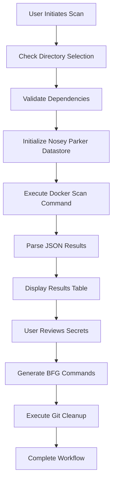
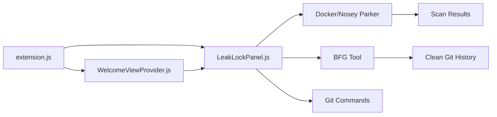

# 🏗️ Architecture Documentation

## 📋 Overview

Leak Lock follows a modular architecture with clear separation of concerns between UI, business logic, and external tool integration.

## 🧩 Core Components

### 1. **Extension.js** - Main Entry Point
```javascript
// Primary responsibilities:
- Extension activation and deactivation
- Command registration and routing
- Dependency management and cleanup
- Status bar integration
- Global state management
```

**Key Functions:**
- `activate(context)` - Extension initialization
- `deactivate()` - Cleanup on uninstall
- `installDependencies()` - Automated dependency setup
- `cleanupDependencies()` - Complete cleanup process
- `checkDependencies()` - Validation of installed tools

### 2. **LeakLockPanel.js** - Main Interface
```javascript
// Primary responsibilities:
- Main area webview panel management
- Scanning workflow orchestration
- Results display and processing
- BFG tool integration
- User interaction handling
 - Remove Files flow (repo + file/dir selection, BFG preparation, confirmation)
```

**Key Methods:**
- `createOrShow(extensionUri)` - Static panel management
- `_scanRepository(useWorkspace)` - Repository scanning logic
- `_fixSecrets(replacements)` - Secret remediation workflow
- `_runBFGCommand(replacements)` - Git history cleanup
- `_getHtmlForWebview()` - UI rendering

### 3. **WelcomeViewProvider.js** - Activity Bar Integration
```javascript
// Primary responsibilities:
- Activity bar sidebar view
- Welcome interface rendering
- Main panel launch functionality
- Initial user experience
```

**Key Methods:**
- `resolveWebviewView()` - Sidebar view initialization
- `_getHtmlForWebview()` - Welcome UI rendering

## 🔄 Data Flow

### Scanning Workflow


### Component Interaction


## 🎨 UI Architecture

### Main Area Panel Layout
```
┌─────────────────────────────────────────────────────────────┐
│ 🛡️ Leak Lock Scanner                                        │
├─────────────────────────────────────────────────────────────┤
│ ✅ Setup Complete                                           │
│ 🐳 Docker running • 🔧 BFG tool ready • 🔍 Nosey Parker   │
│ [🔄 Reinstall] [🔧 Reset Status]                           │
├─────────────────────────────────────────────────────────────┤
│ 📁 Scan Directory                                           │
│ 📂 Current Directory: /home/user/project                   │
│ [🔄 Change Directory]                                       │
├─────────────────────────────────────────────────────────────┤
│ 🔍 Security Scan                                            │
│ [🔍 Scan Selected Directory] [📂 Scan Current Workspace]   │
├─────────────────────────────────────────────────────────────┤
│ 📊 Scan Results                                             │
│ ┌─────────────────────────────────────────────────────────┐ │
│ │ Type    │ File      │ Line │ Preview      │ Actions    │ │
│ │ API Key │ config.js │ 15   │ api_key="..." │ [Fix] [×] │ │
│ │ Token   │ auth.py   │ 23   │ token = "..." │ [Fix] [×] │ │
│ └─────────────────────────────────────────────────────────┘ │
├─────────────────────────────────────────────────────────────┤
│ ⚡ Execute BFG Cleanup                                       │
│ [🚀 Run BFG + Git Cleanup]                                  │
└─────────────────────────────────────────────────────────────┘
```

### Activity Bar Integration
```
Activity Bar    Sidebar View
┌─────────┐    ┌──────────────────┐
│  Files  │    │ 🛡️ Leak Lock     │
│  Search │    │ Scanner          │
│  SCM    │    │                  │
│ 🛡️ Leak │ -> │ Secure your code │
│  Debug  │    │ repositories...  │
│  Ext    │    │                  │
└─────────┘    │ [🚀 Open Scanner]│
               └──────────────────┘
```

## 🔧 External Tool Integration

### Docker/Nosey Parker Integration
```javascript
// Command structure for Nosey Parker scanning
const initCommand = `docker run --rm -v "${datastorePath}:/datastore" 
    ghcr.io/praetorian-inc/noseyparker:latest 
    datastore init --datastore /datastore`;

const scanCommand = `docker run --rm -v "${scanPath}:/scan" 
    -v "${datastorePath}:/datastore" 
    ghcr.io/praetorian-inc/noseyparker:latest 
    scan --datastore /datastore /scan`;

const reportCommand = `docker run --rm -v "${datastorePath}:/datastore" 
    ghcr.io/praetorian-inc/noseyparker:latest 
    report --datastore /datastore --format json`;
```

### BFG Tool Integration
```javascript
// BFG command generation for secret removal
const bfgCommand = `java -jar bfg.jar --replace-text ${replacementsFile}`;
const cleanupCommands = [
    `cd ${scanPath}`,
    bfgCommand,
    `git reflog expire --expire=now --all`,
    `git gc --prune=now --aggressive`
];
```

// BFG command generation for file/folder removal
// Combined mode (single command):
//   java -jar bfg.jar --delete-files "name1|name2" --delete-folders "dir1|dir2" "<repo>"
// Individual mode (per-item commands):
//   java -jar bfg.jar --delete-files "name1" "<repo>" && java -jar bfg.jar --delete-folders "dir1" "<repo>" && ...
// Note: BFG matches by name across history (not full paths)

## 📊 State Management

### Panel State
```javascript
class LeakLockPanel {
    constructor(extensionUri) {
        this._extensionUri = extensionUri;           // Extension context
        this._scanResults = [];                      // Scan results array
        this._replacementValues = {};                // User replacement inputs
        this._selectedDirectory = null;              // Selected scan directory
        this._isScanning = false;                    // Scanning state flag
        this._scanProgress = null;                   // Progress tracking
        this._dependenciesInstalled = false;         // Dependency status
        this._panel = null;                          // Webview panel reference
    }
}
```

### Static Panel Management
```javascript
// Singleton pattern for panel management
static get currentPanel() {
    return LeakLockPanel._currentPanel;
}

static createOrShow(extensionUri) {
    if (LeakLockPanel.currentPanel) {
        LeakLockPanel.currentPanel._panel.reveal(column);
        return;
    }
    // Create new panel...
}
```

## 🔄 Lifecycle Management

### Extension Activation
```javascript
function activate(context) {
    // 1. Install dependencies automatically
    installDependencies();
    
    // 2. Register webview providers
    const welcomeProvider = new WelcomeViewProvider(context.extensionUri);
    context.subscriptions.push(
        vscode.window.registerWebviewViewProvider(
            WelcomeViewProvider.viewType, 
            welcomeProvider
        )
    );
    
    // 3. Register commands
    context.subscriptions.push(
        vscode.commands.registerCommand('leak-lock.openPanel', () => {
            LeakLockPanel.createOrShow(context.extensionUri);
        })
    );
    
    // 4. Setup status bar
    const icon = vscode.window.createStatusBarItem();
    icon.text = '$(shield)';
    icon.command = 'leak-lock.scanRepository';
    icon.show();
}
```

### Extension Deactivation
```javascript
async function deactivate() {
    try {
        await cleanupDependencies();
        // - Remove Docker images
        // - Delete BFG tool
        // - Clean temporary files
        // - Remove Docker volumes
    } catch (error) {
        console.error('Cleanup error:', error);
    }
}
```

## 🎯 Design Patterns

### 1. **Singleton Pattern** - Panel Management
```javascript
static get currentPanel() {
    return LeakLockPanel._currentPanel;
}
```

### 2. **Observer Pattern** - Progress Tracking
```javascript
vscode.window.withProgress({
    location: vscode.ProgressLocation.Notification,
    title: "Scanning for secrets...",
    cancellable: false
}, async (progress) => {
    progress.report({ increment: 20, message: "Initializing..." });
    // ... scanning logic
});
```

### 3. **Command Pattern** - Action Handling
```javascript
webviewView.webview.onDidReceiveMessage(message => {
    switch (message.command) {
        case 'scan':
            this._scanRepository(message.useWorkspace);
            break;
        case 'fix':
            this._fixSecrets(message.replacements);
            break;
    }
});
```

### 4. **Factory Pattern** - UI Generation
```javascript
_getHtmlForWebview() {
    const hasResults = this._scanResults.length > 0;
    return `
        <!DOCTYPE html>
        <html>
        ${this._generateHeader()}
        ${this._generateBody(hasResults)}
        ${this._generateScripts()}
        </html>
    `;
}
```

## 🔒 Security Considerations

### 1. **Input Validation**
- All user inputs are sanitized before processing
- File paths are validated for directory traversal
- Command injection prevention in Docker/BFG commands

### 2. **Secure Communication**
- Webview to extension communication uses VS Code message API
- No direct file system access from webview
- All operations go through extension host

### 3. **Temporary File Management**
- Secure temporary file creation and cleanup
- Proper file permission handling
- Automatic cleanup on extension deactivation

### 4. **Tool Isolation**
- Docker containerization for Nosey Parker
- No direct shell access from webview
- Controlled command execution with validation

## 📈 Performance Considerations

### 1. **Lazy Loading**
- Extension activates on first use
- Docker images downloaded only when needed
- BFG tool downloaded on first scan

### 2. **Memory Management**
- Large scan results paginated in UI
- Temporary files cleaned up promptly
- Docker containers removed after use

### 3. **Async Operations**
- All scanning operations are asynchronous
- Progress reporting for long-running tasks
- Non-blocking UI updates

### 4. **Resource Cleanup**
- Proper disposal of webview panels
- Docker container cleanup
- File handle management

## 🔄 Extension Points

### Adding New Secret Types
1. Nosey Parker handles pattern detection
2. Results parsing in `_scanRepository()`
3. UI updates in `_getResultsHtml()`

### Adding New Tools
1. Add to `checkDependencies()` function
2. Implement installation in `installDependencies()`
3. Add cleanup to `cleanupDependencies()`
4. Update UI to show tool status

### Extending UI
1. Update HTML templates in `_getHtmlForWebview()`
2. Add message handlers in `onDidReceiveMessage()`
3. Update CSS styling for new components

This architecture provides a solid foundation for secure, maintainable, and extensible security tooling within VS Code.
