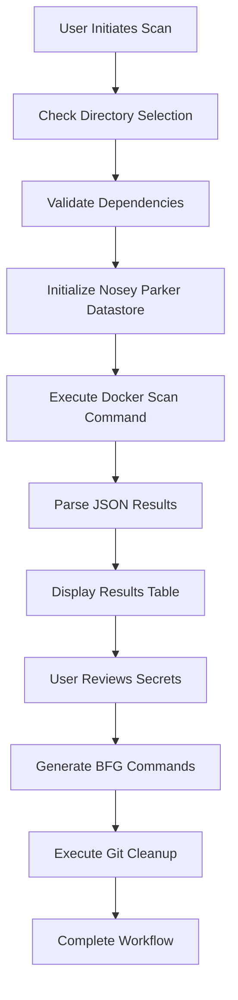
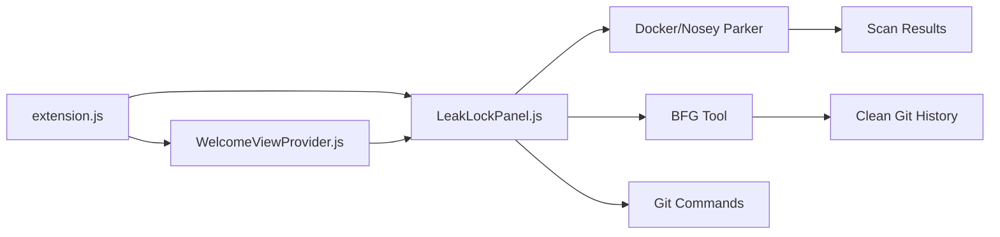

# 🏗️ Architecture Documentation

## 📋 Overview

Leak Lock follows a modular architecture with clear separation of concerns between UI, business logic, and external tool integration.

## 🧩 Core Components

### 1. **Extension.js** - Main Entry Point
```javascript
// Primary responsibilities:
- Extension activation and deactivation
- Command registration and routing
- Dependency management and cleanup
- Status bar integration
- Global state management
```

**Key Functions:**
- `activate(context)` - Extension initialization
- `deactivate()` - Cleanup on uninstall
- `installDependencies()` - Automated dependency setup
- `cleanupDependencies()` - Complete cleanup process
- `checkDependencies()` - Validation of installed tools

### 2. **LeakLockPanel.js** - Main Interface
```javascript
// Primary responsibilities:
- Main area webview panel management
- Scanning workflow orchestration
- Results display and processing
- BFG tool integration
- User interaction handling
 - Remove Files flow (repo + file/dir selection, BFG preparation, confirmation)
```

**Key Methods:**
- `createOrShow(extensionUri)` - Static panel management
- `_scanRepository(useWorkspace)` - Repository scanning logic
- `_fixSecrets(replacements)` - Secret remediation workflow
- `_runBFGCommand(replacements)` - Git history cleanup
- `_getHtmlForWebview()` - UI rendering

### 3. **WelcomeViewProvider.js** - Activity Bar Integration
```javascript
// Primary responsibilities:
- Activity bar sidebar view
- Welcome interface rendering
- Main panel launch functionality
- Initial user experience
```

**Key Methods:**
- `resolveWebviewView()` - Sidebar view initialization
- `_getHtmlForWebview()` - Welcome UI rendering

## 🔄 Data Flow

### Scanning Workflow

```mermaid
graph TD
    A[User Initiates Scan] --> B[Check Directory Selection]
    B --> C[Validate Dependencies]
    C --> D[Initialize Nosey Parker Datastore]
    D --> E[Execute Docker Scan Command]
    E --> F[Parse JSON Results]
    F --> G[Display Results Table]
    G --> H[User Reviews Secrets]
    H --> I[Generate BFG Commands]
    I --> J[Execute Git Cleanup]
    J --> K[Complete Workflow]
```

### Component Interaction

```mermaid
graph LR
    A[extension.js] --> B[LeakLockPanel.js]
    A --> C[WelcomeViewProvider.js]
    C --> B
    B --> D[Docker/Nosey Parker]
    B --> E[BFG Tool]
    B --> F[Git Commands]
    D --> G[Scan Results]
    E --> H[Clean Git History]
```

## 🎨 UI Architecture

### Main Area Panel Layout
```
┌─────────────────────────────────────────────────────────────┐
│ 🛡️ Leak Lock Scanner                                        │
├─────────────────────────────────────────────────────────────┤
│ ✅ Setup Complete                                           │
│ 🐳 Docker running • 🔧 BFG tool ready • 🔍 Nosey Parker   │
│ [🔄 Reinstall] [🔧 Reset Status]                           │
├─────────────────────────────────────────────────────────────┤
│ 📁 Scan Directory                                           │
│ 📂 Current Directory: /home/user/project                   │
│ [🔄 Change Directory]                                       │
├─────────────────────────────────────────────────────────────┤
│ 🔍 Security Scan                                            │
│ [🔍 Scan Selected Directory] [📂 Scan Current Workspace]   │
├─────────────────────────────────────────────────────────────┤
│ 📊 Scan Results                                             │
│ ┌─────────────────────────────────────────────────────────┐ │
│ │ Type    │ File      │ Line │ Preview      │ Actions    │ │
│ │ API Key │ config.js │ 15   │ api_key="..." │ [Fix] [×] │ │
│ │ Token   │ auth.py   │ 23   │ token = "..." │ [Fix] [×] │ │
│ └─────────────────────────────────────────────────────────┘ │
├─────────────────────────────────────────────────────────────┤
│ ⚡ Execute BFG Cleanup                                       │
│ [🚀 Run BFG + Git Cleanup]                                  │
└─────────────────────────────────────────────────────────────┘
```

### Activity Bar Integration
```
Activity Bar    Sidebar View
┌─────────┐    ┌──────────────────┐
│  Files  │    │ 🛡️ Leak Lock     │
│  Search │    │ Scanner          │
│  SCM    │    │                  │
│ 🛡️ Leak │ -> │ Secure your code │
│  Debug  │    │ repositories...  │
│  Ext    │    │                  │
└─────────┘    │ [🚀 Open Scanner]│
               └──────────────────┘
```

### Credential identification

`credential-inspect.js` is the only module that touches
[`@nikolareljin/credential-lens`](https://github.com/nikolareljin/credential-lens). Leak
Lock is CommonJS and the library is ESM, so the boundary is crossed exactly once, through
`await import()`, and nothing else in the codebase has to become async to accommodate it.
The library is bundled into the `.vsix`: it is 41 KB with zero dependencies and runs
in-process, so runtime installation would trade one packaging test for a network
requirement and version drift.

Around it:

| Module | Responsibility |
|---|---|
| `credential-sniff.js` | Pure, synchronous shape check — is this snippet worth reading the whole file for? |
| `credential-prepass.js` | Post-scan classification over snippet bytes only, bounded and concurrency-limited, so it never scales with repository size |
| `credential-report-html.js` | Renders the report; kept separate so the escaping is directly testable |

Nothing here may throw into a scan. Credential inspection enriches findings that already
exist, so every failure degrades to a declined report rather than a failed scan — and the
Dependencies panel reports the library as ready only after the import has actually
succeeded, never from the mere presence of a dependency entry.

### Linking findings to their commit

`git-permalink.js` parses `git remote get-url` into `{host, owner, repo}` and builds
provider URLs. It is deliberately distinct from `detectRemoteProvider` in `git-rewrite.js`,
which matches provider names out of git *error text* and cannot yield an owner or repo.

The path needs care: a finding's `file` is relative to the **scanned directory**, while a
permalink needs it relative to the **git root**, and some engines report a path already
prefixed with the repository's own directory name. Both readings can be legitimate — a repo
may genuinely contain a top-level directory sharing its name — so `finding-paths.js`
returns ordered candidates and `findPathInCommit` asks git (`cat-file -e`) which one exists
at that commit. The repository is the authority; a guess produces a 404 that reads as Leak
Lock pointing at the wrong commit.

The webview sends **indices, never URLs**. The host rebuilds the address from its own state
and revalidates scheme and host before `openExternal`, so a crafted message cannot turn it
into a launcher for an arbitrary address.

## 🔧 External Tool Integration

### Detection Engines

Engine invocation lives in `scan-engine-config.js` (Nosey Parker) and `scan-engines.js`
(Gitleaks, TruffleHog). Neither imports `vscode`, so every argument list is unit-testable
without a VS Code host — these flags decide whether findings are reported or discarded,
so they need to be directly assertable.

See [SCANNING_ENGINES.md](SCANNING_ENGINES.md) for the full comparison.

### Reading a report back in

`scan-baseline.js` parses a previously exported report and decides, per finding, whether it
is resolved. It has no `vscode` import either, so the matching tiers and the
never-resolve-what-was-not-checked rule are unit-testable directly.

Presence is measured against the repository rather than against a scanner, because that is
what a rewrite actually changes:

```javascript
git -C <repo> log --all --max-count=1 --format=%H -S<value>   // history, incl. deleted content
git -C <repo> grep --fixed-strings --quiet --untracked -e <value>   // working tree
git -C <repo> log --all --reverse --max-count=1 --format='%H %aI' -S<value>  // when it appeared
```

Identity is matched by `fingerprint`, then value plus file plus rule, then value alone;
never by file and line, which drift. A value that cannot be searched for (redacted export,
or an engine-decoded value) is reported unverifiable, never resolved.

**Repository identity** is recorded in the export (`repository.rootCommits`,
`repository.remote`) and checked on import. Root commits are the strong signal: every clone,
fork and mirror shares them, and two unrelated repositories do not. The remote is the
fallback for reports that predate it. The path is recorded for a human reader and never
compared, because a repository is not where it happens to sit on one machine. A known
mismatch refuses the import; an unknown identity allows it with the uncertainty stated.

```javascript
// Nosey Parker — pinned image, no inherited truncation.
// The image was previously :latest; the report flags were previously absent, and the
// upstream defaults (--max-matches 3, --max-provenance 3, --min-score 0.05) silently
// discarded findings before they were ever parsed.
scan:   docker run --rm -v <scan>:/scan -v <ds>:/datastore \
            ghcr.io/praetorian-inc/noseyparker:v0.24.0 \
            scan --datastore /datastore --git-history full \
                 --ruleset <mode> --max-file-size <n> [--ignore /leaklock-ignore] /scan

report: docker run --rm -v <ds>:/datastore \
            ghcr.io/praetorian-inc/noseyparker:v0.24.0 \
            report --datastore /datastore --format json \
                   --max-matches -1 --max-provenance -1 --min-score 0 \
                   --suppress-redundant <bool>

// Gitleaks — two passes; a failing pass does not discard the other's results.
// Subcommands are probed from --help, since 8.19 renamed them and distribution builds
// often report no version string.
history:  gitleaks git --log-opts=--all --report-format json --report-path <tmp> \
              --exit-code 0 --no-banner <repo>
worktree: gitleaks dir --report-format json --report-path <tmp> --exit-code 0 --no-banner <repo>
// pre-8.19: gitleaks detect --source <repo> [--log-opts=--all | --no-git] ...

// TruffleHog — JSON Lines; verification is opt-in because it makes outbound calls
// using the discovered credential.
trufflehog git file://<repo> --json --no-update --results=verified,unknown
trufflehog git file://<repo> --json --no-update --no-verification
```

The datastore is created under `os.tmpdir()`, never inside the tree being scanned.

### BFG Tool Integration
```javascript
// BFG command generation for secret removal
const bfgCommand = `java -jar bfg.jar --replace-text ${replacementsFile}`;
const cleanupCommands = [
    `cd ${scanPath}`,
    bfgCommand,
    `git reflog expire --expire=now --all`,
    `git gc --prune=now --aggressive`
];
```

// BFG command generation for file/folder removal
// Combined mode (single command):
//   java -jar bfg.jar --delete-files "name1|name2" --delete-folders "dir1|dir2" "<repo>"
// Individual mode (per-item commands):
//   java -jar bfg.jar --delete-files "name1" "<repo>" && java -jar bfg.jar --delete-folders "dir1" "<repo>" && ...
// Note: BFG matches by name across history (not full paths)

## 📊 State Management

### Panel State
```javascript
class LeakLockPanel {
    constructor(extensionUri) {
        this._extensionUri = extensionUri;           // Extension context
        this._scanResults = [];                      // Scan results array
        this._replacementValues = {};                // User replacement inputs
        this._selectedDirectory = null;              // Selected scan directory
        this._isScanning = false;                    // Scanning state flag
        this._scanProgress = null;                   // Progress tracking
        this._dependenciesInstalled = false;         // Dependency status
        this._importedReport = null;                 // A previous export, read back in
        this._importedComparison = null;             // Its findings, checked against now
        this._panel = null;                          // Webview panel reference
    }
}
```

The imported report sits outside `_scanCleanup` deliberately. Its findings describe a past
state: they are never cleanup targets, are not selectable, and survive a re-scan, because
comparing them against a fresh scan is the whole point of holding them.

### Static Panel Management
```javascript
// Singleton pattern for panel management
static get currentPanel() {
    return LeakLockPanel._currentPanel;
}

static createOrShow(extensionUri) {
    if (LeakLockPanel.currentPanel) {
        LeakLockPanel.currentPanel._panel.reveal(column);
        return;
    }
    // Create new panel...
}
```

## 🔄 Lifecycle Management

### Extension Activation
```javascript
function activate(context) {
    // 1. Install dependencies automatically
    installDependencies();
    
    // 2. Register webview providers
    const welcomeProvider = new WelcomeViewProvider(context.extensionUri);
    context.subscriptions.push(
        vscode.window.registerWebviewViewProvider(
            WelcomeViewProvider.viewType, 
            welcomeProvider
        )
    );
    
    // 3. Register commands
    context.subscriptions.push(
        vscode.commands.registerCommand('leak-lock.openPanel', () => {
            LeakLockPanel.createOrShow(context.extensionUri);
        })
    );
    
    // 4. Setup status bar
    const icon = vscode.window.createStatusBarItem();
    icon.text = '$(shield)';
    icon.command = 'leak-lock.scanRepository';
    icon.show();
}
```

### Extension Deactivation
> ⚠️ Known defect (issue #59): cleanup currently runs from `deactivate()`, which VS Code
> invokes on every window reload, not only on uninstall. Tools are therefore removed and
> re-downloaded far more often than intended.

```javascript
async function deactivate() {
    try {
        await cleanupDependencies();
        // - Remove Docker images
        // - Delete BFG tool
        // - Clean temporary files
        // - Remove Docker volumes
    } catch (error) {
        console.error('Cleanup error:', error);
    }
}
```

## 🎯 Design Patterns

### 1. **Singleton Pattern** - Panel Management
```javascript
static get currentPanel() {
    return LeakLockPanel._currentPanel;
}
```

### 2. **Observer Pattern** - Progress Tracking
```javascript
vscode.window.withProgress({
    location: vscode.ProgressLocation.Notification,
    title: "Scanning for secrets...",
    cancellable: false
}, async (progress) => {
    progress.report({ increment: 20, message: "Initializing..." });
    // ... scanning logic
});
```

### 3. **Command Pattern** - Action Handling
```javascript
webviewView.webview.onDidReceiveMessage(message => {
    switch (message.command) {
        case 'scan':
            this._scanRepository(message.useWorkspace);
            break;
        case 'fix':
            this._fixSecrets(message.replacements);
            break;
    }
});
```

### 4. **Factory Pattern** - UI Generation
```javascript
_getHtmlForWebview() {
    const hasResults = this._scanResults.length > 0;
    return `
        <!DOCTYPE html>
        <html>
        ${this._generateHeader()}
        ${this._generateBody(hasResults)}
        ${this._generateScripts()}
        </html>
    `;
}
```

## 🔒 Security Considerations

### 1. **Input Validation**
- All user inputs are sanitized before processing
- File paths are validated for directory traversal
- Command injection prevention in Docker/BFG commands

### 2. **Secure Communication**
- Webview to extension communication uses VS Code message API
- No direct file system access from webview
- All operations go through extension host

### 3. **Temporary File Management**
- Secure temporary file creation and cleanup
- Proper file permission handling
- Automatic cleanup on extension deactivation
- Rewrite rule files (`--replace-text`) are the exception to "put it in `$TMPDIR`":
  they are created inside the repository's git directory (`gitRewrite.createRulesFile`),
  because a confined `git-filter-repo` build cannot read a host temp path, and they are
  removed only once the rewrite finished — a failed run keeps the file and reports where
  it is, since it is the only materialised copy of what still has to be redacted

### 4. **Tool Isolation**
- Docker containerization for Nosey Parker
- No direct shell access from webview
- Controlled command execution with validation

## 📈 Performance Considerations

### 1. **Lazy Loading**
- Extension activates on first use
- Docker images downloaded only when needed
- BFG tool downloaded on first scan

### 2. **Memory Management**
- Large scan results paginated in UI
- Temporary files cleaned up promptly
- Docker containers removed after use

### 3. **Async Operations**
- All scanning operations are asynchronous
- Progress reporting for long-running tasks
- Non-blocking UI updates

### 4. **Resource Cleanup**
- Proper disposal of webview panels
- Docker container cleanup
- File handle management

## 🔄 Extension Points

### Adding a Detection Engine
1. Add an adapter to `scan-engines.js`: `isAvailable()`, `version()`, `scan()`, and a
   `capabilities` block declaring which normalised fields it cannot supply
2. Map its output onto the normalised finding shape
3. Route it through `_createResultFromEngineFinding()` so it gets the same
   post-processing as every other engine — severity, dependency classification,
   untracked detection, enrichment and truncation must not be re-implemented per adapter
4. Add it to the `leakLock.scan.engines` enum in `package.json`
5. Extend the field-parity conformance test: a new engine may add fields, never render fewer

### Adding New Tools
1. Add to `checkDependencies()` function
2. Implement installation in `installDependencies()`
3. Add cleanup to `cleanupDependencies()`
4. Update UI to show tool status

### Extending UI
1. Update HTML templates in `_getHtmlForWebview()`
2. Add message handlers in `onDidReceiveMessage()`
3. Update CSS styling for new components

This architecture provides a solid foundation for secure, maintainable, and extensible security tooling within VS Code.
