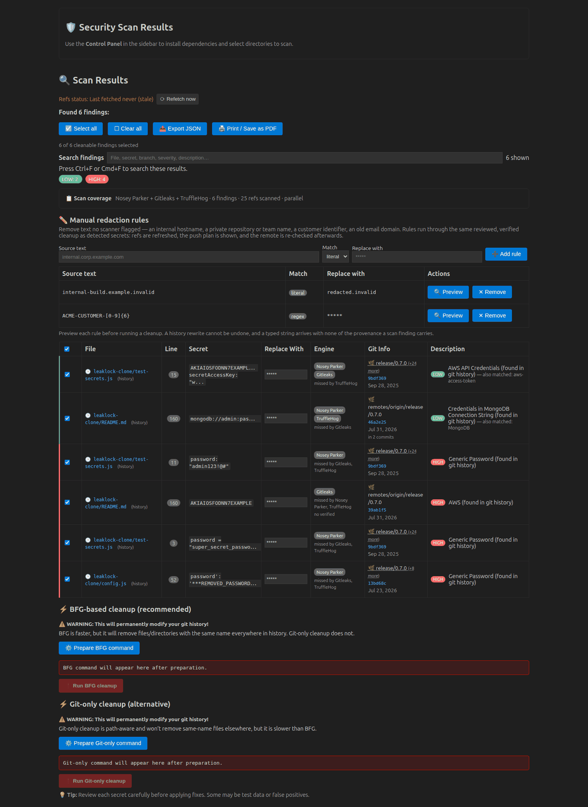
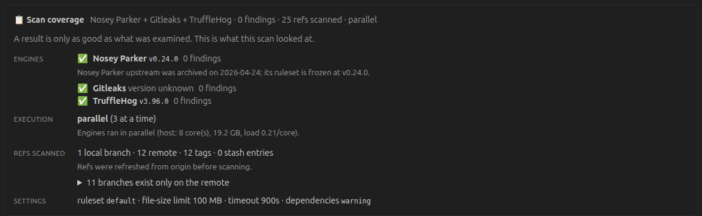

# 🔎 Scanning Engines

Leak Lock runs more than one secret-detection engine and merges the results into a single
attributed set. This page explains which engines exist, what each is good at, what each
cannot do, and how to choose between them.

## Why more than one engine

The engines disagree more than you would expect. On a purpose-built fixture repository —
a secret in `HEAD`, a secret in a file deleted later, a secret on a branch not reachable
from `HEAD`, and a secret in a `.gitignore`d `.env` — the results were:

| Engine | Findings | Rules matched |
|---|---:|---|
| Gitleaks | **7** | `aws-access-token` ×4, `github-pat`, `slack-access-token`, `stripe-access-token` |
| Nosey Parker v0.24.0 | **2** | `Slack Bot Token`, `Stripe API Key` |

Nosey Parker missed an AWS key and a GitHub personal access token that were sitting in
tracked, committed, plainly formatted source. That is not a configuration mistake — it is
what happens when a ruleset stops being maintained.

This is why the results table shows, for every finding, **which engines found it and
which enabled engines did not**. A gap against another tool becomes a fact you can check
instead of a mystery.



Above: a real scan of this repository with all three engines. Note the **Engine** column.
The AWS key was found by Nosey Parker *and* Gitleaks but missed by TruffleHog; the MongoDB
credential by Nosey Parker *and* TruffleHog but missed by Gitleaks; the rest by one engine
only. That disagreement, on a repository of a few dozen files, is the argument for running
more than one engine.

Nothing carries a `VERIFIED LIVE` badge because verification was enabled and TruffleHog
correctly verified none of these — they are synthetic fixtures from `test-secrets.js`, not
live credentials. The full run returned 59 findings; the image shows six, chosen to span
the engines.

---

## Gitleaks — the default engine

| | |
|---|---|
| Project | <https://github.com/gitleaks/gitleaks> |
| Licence | MIT |
| Status | Actively maintained |
| Runtime | A single static binary. **No Docker, no JVM.** |
| Install | `brew install gitleaks` · `apt install gitleaks` · release binary |

**What it does.** Two passes:

- **History** — every ref, via `--log-opts=--all` passed through to `git log -p`. Without
  `--all` a scan only covers the current branch, which is the same class of blind spot
  that unfetched remote refs create.
- **Working tree** — a separate pass that also covers untracked and `.gitignore`d files.
  A local `.env` is the single most likely place to find a live credential on a
  developer machine, and it is not in history at all.

A failing pass does not discard the other's results.

**What it gives you beyond the others.** End line, column range, entropy, commit author
and email, commit message, and a stable `Fingerprint`. The fingerprint is what makes
`--baseline-path` work, so it is the foundation for suppressing already-reviewed
findings.

**What it cannot do.** It does not verify whether a credential still works. That is
declared, so the results table shows *not provided by this engine* rather than an
ambiguous blank.

**A note on CLI versions.** Gitleaks renamed its subcommands in 8.19 (`detect` became
`git`, and `detect --no-git` became `dir`). Many distribution builds also report no
version at all — Ubuntu's package prints `version is set by build process`. Leak Lock
therefore probes `gitleaks --help` for the available subcommands rather than parsing a
version number, and supports both generations.

**Settings**

| Setting | Purpose |
|---|---|
| `leakLock.gitleaks.binaryPath` | Path to the binary; empty resolves `gitleaks` from `PATH` |
| `leakLock.gitleaks.configPath` | A gitleaks TOML config with custom rules or allowlists |
| `leakLock.gitleaks.baselinePath` | A baseline report; findings in it are not re-reported |

---

## TruffleHog — optional, credential verification

| | |
|---|---|
| Project | <https://github.com/trufflesecurity/trufflehog> |
| Licence | AGPL-3.0 |
| Status | Actively maintained |
| Runtime | A single binary |
| Install | `brew install trufflehog` · release binary |

**What it does that nothing else here does.** It answers *is this credential still live?*
by making read-only API calls against 700+ providers, and marks each finding
`Verified: true` or not.

That is a categorical improvement in triage. A verified AWS key in a five-year-old commit
is an active incident that needs the key **rotated** — and only then a history rewrite.
An unverified high-entropy string that matched a generic rule is probably noise. Without
verification those two look identical in a results table.

Leak Lock ranks a verified finding above every rule-name heuristic and badges it
`VERIFIED LIVE`, because rewriting history does not revoke a working key.

**Privacy — read this before enabling it.** Verification sends the discovered credential
to the provider it belongs to. The calls are read-only and that is exactly how the
provider tells you whether the key is valid, but it is still an outbound request carrying
a secret. It is **off by default**; set `leakLock.trufflehog.verify` deliberately.
Verification status is recorded with a timestamp, since "verified live" is a claim about
a moment in time.

**What it cannot do.** No end line, no column range, no entropy, no fingerprint, and no
rule description (Leak Lock derives a description from the detector name rather than
leaving the column blank). All of these are declared as unavailable for this engine.

**Licensing.** TruffleHog is AGPL-3.0 and Leak Lock is MIT. Leak Lock invokes it as an
external process — no bundling, no linking, no derived work — so the licences do not
interact. Nothing is downloaded automatically; you install the binary yourself.

---

## Nosey Parker — optional, legacy

| | |
|---|---|
| Project | <https://github.com/praetorian-inc/noseyparker> |
| Licence | Apache-2.0 |
| Status | ⚠️ **Archived read-only on 2026-04-24** |
| Final release | `v0.24.0`, 2025-05-08 |
| Runtime | Docker |
| Image | `ghcr.io/praetorian-inc/noseyparker:v0.24.0` (pinned) |

Leak Lock was originally built around Nosey Parker. The project is now archived, which
means its ruleset is frozen: whatever detectors GitGuardian and Gitleaks have added since
May 2025, it will never have.

**Why it is still supported.** Its history walker is excellent, and its deduplication
model is the best of the three: it groups matches that share a rule and capture groups
into a single *finding*, and it deduplicates at blob level so byte-identical files
collapse to one match. On a large repository that is the difference between a reviewable
result set and thousands of rows.

**The counting difference matters when comparing tools.** Gitleaks and GitGuardian report
one row per *occurrence*; Nosey Parker reports one *finding* per unique secret. Comparing
raw counts between them was never comparing the same thing. Leak Lock aggregates
occurrences so the two can be read side by side.

**The image is pinned.** It previously tracked `:latest`, which drifted silently between
machines. Since the repository is archived, `v0.24.0` can never move, so pinning is
simply correct. A failed pull is now reported instead of silently falling back to
whatever was cached.

**Settings**

| Setting | Default | Purpose |
|---|---|---|
| `leakLock.noseyParker.ruleset` | `default` | `default` (secrets only), `default+assets` (adds cloud asset and identifier rules), or `all` (every rule — higher recall, more false positives) |
| `leakLock.noseyParker.suppressRedundant` | `true` | Suppress matches overlapping a more specific match. Turn off when reconciling against another scanner |
| `leakLock.noseyParker.maxFileSizeMb` | `100` | Skip larger files; `0` means no limit |
| `leakLock.noseyParker.image` | *(pinned)* | Override the container image |

### A truncation bug worth knowing about

Before v0.7.0, Leak Lock invoked `noseyparker report` with no flags, inheriting upstream
defaults that discard data: `--max-matches 3`, `--max-provenance 3`, `--min-score 0.05`.
Measured on a fixture with one secret in ten distinct blobs:

```
report --format json                                        → 3 matches
report --max-matches=-1 --max-provenance=-1 --min-score 0    → 10 matches
```

Seven of the ten locations never reached the UI. Leak Lock now always passes the
no-limit values. If a cap is ever reintroduced, the results must say so.

---

## Choosing engines

`leakLock.scan.engines` is an ordered list. **All three are enabled by default:**

```jsonc
"leakLock.scan.engines": ["gitleaks", "trufflehog", "noseyparker"]
```

- A missing engine binary **disables that engine, never the scan**. The coverage panel
  states which engines ran, at which versions, and which did not and why — so an engine
  you have not installed is visible rather than silently absent.
- Running all three is the point. Their rulesets genuinely differ, and the attribution
  line tells you when one is falling behind.
- Enabling TruffleHog does **not** on its own make any network call. Verification is a
  separate setting (`leakLock.trufflehog.verify`, off by default).

### If an engine you installed is reported "not installed"

A GUI-launched VS Code does not inherit your shell's `PATH` — on macOS it never does, and
on Linux it frequently misses `~/.local/bin`. Leak Lock therefore also looks in the
places these tools are actually installed: `~/.local/bin`, `~/bin`, `~/go/bin`,
`/usr/local/bin`, `/usr/bin`, `/opt/homebrew/bin`, `/home/linuxbrew/.linuxbrew/bin`, and
the common Windows locations.

If your binary lives somewhere else, point at it directly:

```jsonc
"leakLock.trufflehog.binaryPath": "/opt/tools/trufflehog",
"leakLock.gitleaks.binaryPath": "/opt/tools/gitleaks"
```

---

## How many engines run at once

Three scanners over a large git history is real work, so Leak Lock sizes the plan to the
machine before committing to it. `leakLock.scan.executionMode` defaults to `auto`.

What `auto` inspects:

- **Core count** — `os.cpus().length`
- **Available memory** — respecting **container limits**. `os.totalmem()` reports the
  *host's* memory even inside a container, so in a devcontainer or Codespace — exactly
  where resources are tightest — it over-reports. The cgroup v2 (`/sys/fs/cgroup/memory.max`)
  or v1 limit is used when one is set.
- **Current load** — `os.loadavg()`, so a capable machine that is already saturated is
  not given three more scanners. On Windows this returns `[0,0,0]` rather than failing, so
  it is treated as *unknown* rather than *idle*.

| Tier | Condition | Plan |
|---|---|---|
| **capable** | ≥ 6 cores **and** ≥ 8 GB, not saturated | All enabled engines **in parallel**, capped at `cores − 2` so the editor, language servers and git keep a core |
| **moderate** | Anything in between, or a saturated capable host | All enabled engines, **one at a time**. Slower — but nothing is skipped |
| **constrained** | ≤ 2 cores **or** < 4 GB | **One engine only**: Gitleaks when enabled |

Gitleaks is the engine kept on a constrained host because it is a single static binary
with no container runtime and no JVM, and because it is the only maintained engine with a
full ruleset — so the one engine left standing is also the one most likely to find
something.

### A downgrade is never silent

If host capacity causes an engine to be skipped, the coverage panel says so, names the
skipped engines, and tells you how to override it. Fewer engines means fewer findings,
and quietly scanning with less than you asked for is the same class of failure as a
truncated result set.

### Overriding it

| Value | Behaviour |
|---|---|
| `auto` *(default)* | Size the plan to the machine, as above |
| `parallel` | Always run every enabled engine at once, whatever the host |
| `sequential` | Always run them one at a time — the lightest touch on a busy machine |
| `single` | Run one engine only. Fastest, and finds least |

An explicit value is always honoured, in both directions: you know your machine better
than a heuristic does.

---

## How results are merged

Every engine's output goes through the **same** post-processing, in the same order, so
two engines cannot disagree about what a finding is:

1. Path normalisation (working-tree paths are made repo-relative, so one file is not two rows)
2. Working-tree classification — tracked / untracked / ignored
3. Dependency classification
4. Severity — with a verified credential outranking any rule-name heuristic
5. Git enrichment — containing branches, tags, commit date
6. Display truncation, preserving the full value that remediation needs
7. Cleanup eligibility
8. Occurrence aggregation, then the cross-engine merge

Merging rules. The unit a user acts on is **one secret in one place**, not one detection
event — and a rewrite removes the value everywhere regardless of which commit, rule or
engine surfaced it. So findings are grouped by **file, line and secret**, and everything
that differs is aggregated onto the surviving row rather than duplicated into extra rows:

- **The same secret in several commits** is one row. The commit list is kept and the row
  says *"in N commits"*.
- **The same secret in history and in the working tree** is one row — an engine's history
  pass reports a commit and its working-tree pass does not. The row is flagged
  *"+ working tree"*, because a file still on disk is a different remediation from one
  only in history.
- **Two rules matching one secret** is one row naming both. `github-pat` and
  `generic-api-key` both fire on a GitHub token; that is one credential.
- **Two engines finding one secret** is corroboration, not duplication. The merged row
  carries the **union** of their fields — entropy from one, verification from the other —
  and names every engine that found it. Merging never subtracts detail.
- Engines rarely capture byte-identical spans, so containment counts as the same secret
  and the **longer capture wins**: a rewrite replaces what it is given, and redacting the
  shorter span would leave the remainder in history. Containment requires at least 8
  characters so a fragment cannot swallow a neighbour.
- **Different secrets at the same line stay separate.**
- A field is marked *unavailable* only if **no** reporting engine supplied it.

On a real scan of this repository the three engines produced 78 raw detections, which
collapse to 54 distinct findings — the difference is entirely repeats of the same secret
across commits, passes, rules and engines. Every sighting is still recorded in
`occurrences` and in the JSON export.

## Field parity

A finding from any engine carries at least the fields a Nosey Parker finding carries.
This is enforced by a conformance test, not by review: `file`, `line`, `secret`,
`fullSecret`, `isSecretTruncated`, `description`, `severity`, `isDependency`,
`includeInCleanup`, `originalSeverity`, `ruleName`, `isGitHistory`, `isUntracked`,
`commitHash`, `commitBranches`, `commitDate` — plus `engine`, `engineVersion`,
`verified`, and whatever extra detail the engine supplies.

The JSON export uses identical keys for every finding regardless of engine. A field an
engine did not supply is `null`, never absent, so a consumer parsing the export does not
silently lose columns depending on which engine ran.

---

## Scan coverage

Every scan records what it examined, and it is shown with the results — including when
there are none, because "no findings" is meaningless without its scope:

- engines run, their versions, and how many findings each produced
- engines that did **not** run, and why
- ref counts: local branches, remote branches, tags, stash entries
- branches that exist only on the remote
- whether refs were refreshed before scanning
- ruleset, file-size limit, timeout, dependency handling
- whether the scan was **incomplete** — a timed-out scan reports what it found so far and
  says so, rather than reporting zero findings

The same record goes into the JSON export, so an exported report can be audited later and
an incomplete scan cannot be mistaken for a completed one.



The panel is collapsed to a single summary line by default — *engines · findings · refs
scanned · execution mode*. Any warning (refs not refreshed, engines skipped for host
capacity, a cached scanner image) is promoted into that summary line, and an incomplete
scan keeps its banner outside the toggle entirely: collapsing hides volume, never a
caveat.

---

## Related settings

| Setting | Default | Purpose |
|---|---|---|
| `leakLock.scan.engines` | `["gitleaks","trufflehog","noseyparker"]` | Which engines run, in order |
| `leakLock.scan.executionMode` | `auto` | `auto`, `parallel`, `sequential` or `single` — see [How many engines run at once](#how-many-engines-run-at-once) |
| `leakLock.scan.timeoutSeconds` | `300` | Per-engine timeout. On expiry, partial findings are reported and marked incomplete |
| `leakLock.scan.refreshRefsBeforeScan` | `true` | `git fetch --prune --tags` first, so remote-only branches are not invisible |
| `leakLock.scan.includeIgnoredFiles` | `false` | Also scan working-tree files excluded by `.gitignore` |
| `leakLock.dependencyHandling` | `warning` | `exclude` skips only unambiguously third-party directories — `lib/`, `bin/`, `dist/` and `build/` are still scanned, because skipping them would hide real secrets |
